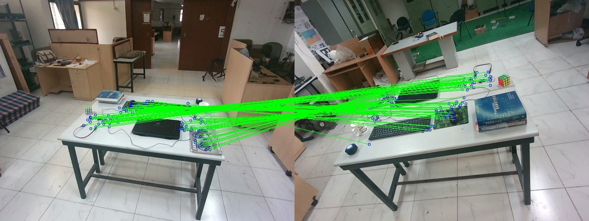

# RoRD
Rotation-Robust Descriptors and Orthographic Views for Local Feature Matching

> [Project Page](https://uditsinghparihar.github.io/RoRD/) | [Paper link](https://arxiv.org/abs/2103.08573)

 

## Evaluation and Datasets

- **MMA** : Training on [PhotoTourism](https://www.cs.ubc.ca/~kmyi/imw2020/data.html) and testing on [HPatches](https://github.com/hpatches/hpatches-dataset) and proposed [Rotated HPatches](add_link)
- **Pose Estimation** : Training on same PhotoTourism datasets as used for MMA and testing on proposed [DiverseView](https://drive.google.com/file/d/1BkhcHBKwcjNHgbLZ1XKurpcP7v4hFD_b/view?usp=sharing)  
- **Visual Place Recognition** : Oxford RobotCar [training sequence](https://robotcar-dataset.robots.ox.ac.uk/datasets/2014-07-14-14-49-50/) and [testing sequence](https://robotcar-dataset.robots.ox.ac.uk/datasets/2014-06-26-09-24-58/)


## Pretrained Models

Download models from [Google Drive](https://drive.google.com/file/d/1-5aLHyZ_qlHFNfRnDpXUh5egtf_XtoiA/view?usp=sharing) (73.9 MB) in the base directory.  

## Evaluating RoRD  
You can evaluate RoRD on demo images or replace it with your custom images.  
1. Dependencies can be installed in a `conda` of `virtualenv` by running:   
	1. `pip install -r requirements.txt`  
2. `python extractMatch.py <rgb_image1> <rgb_image2> --model_file  <path to the model file RoRD>`
3. Example:  
	`python extractMatch.py demo/rgb/rgb1_1.jpg demo/rgb/rgb1_2.jpg --model_file models/rord.pth --sift`  
4. This should give you output like this:  

#### RoRD  
   

#### SIFT  
  


## DiverseView Dataset  

Download dataset from [Google Drive](https://drive.google.com/file/d/1BkhcHBKwcjNHgbLZ1XKurpcP7v4hFD_b/view?usp=sharing) (97.8 MB) in the base directory (only needed if you want to evaluate on DiverseView Dataset).    

## Evaluation on DiverseView Dataset  
The DiverseView Dataset is a custom dataset consisting of 4 scenes with images having high-angle camera rotations and viewpoint changes.  
1. Pose estimation on single image pair of DiverseView dataset:  
	1. `cd demo`  
	2. `python register.py --rgb1 <path to rgb image 1> --rgb2 <path to rgb image 2> --depth1 <path to depth image 1> --depth2 <path to depth image 2> --model_rord <path to the model file RoRD>`  
	3. Example:   
		`python register.py --rgb1 rgb/rgb2_1.jpg --rgb2 rgb/rgb2_2.jpg --depth1 depth/depth2_1.png --depth2 depth/depth2_2.png --model_rord ../models/rord.pth`  
	4. This should give you output like this:  

#### RoRD  
  


2. Pose estimation on a sequence of DiverseView dataset:  
	1. `cd evaluation/DiverseView/`  
	2. `python evalRT.py --rgb_csv <csv file containing query-database rgb image pairs> --depth_csv <csv file containing query-database depth image pairs> --output_dir <path to the output directory> --camera_file <path to the camera intrinsics txt file> --model_rord <path to the model file RoRD>`  


## Training RoRD on PhotoTourism Images  
1. Training using rotation homographies with initialization from D2Net weights (Download base models as mentioned in [Pretrained Models](#pretrained-models)).  

2. Download branderburg_gate dataset that is used in the `configs/train_scenes_small.txt` from [here](https://www.cs.ubc.ca/research/kmyi_data/imw2020/TrainingData/brandenburg_gate.tar.gz)(5.3 Gb) in `phototourism` folder.  

3. Folder stucture should be:  
	```
	phototourism/  
	___ brandenburg_gate  
	___ ___ dense  
	___ ___	___ images  
	___ ___	___ stereo  
	___ ___	___ sparse  
	```  

4. `python trainPT_ipr.py --dataset_path <path_to_phototourism_folder> --init_model models/d2net.pth  --plot`  

## Credits
Our base model is borrowed from [D2-Net](https://github.com/mihaidusmanu/d2-net).  

## BibTex
If you use this code in your project, please cite the following paper:

```bibtex

@misc{rord2021,
      title={RoRD: Rotation-Robust Descriptors and Orthographic Views for Local Feature Matching}, 
      author={Udit Singh Parihar and Aniket Gujarathi and Kinal Mehta and Satyajit Tourani and Sourav Garg and Michael Milford and K. Madhava Krishna},
      year={2021},
      eprint={2103.08573},
      archivePrefix={arXiv},
      primaryClass={cs.CV}
}
```

