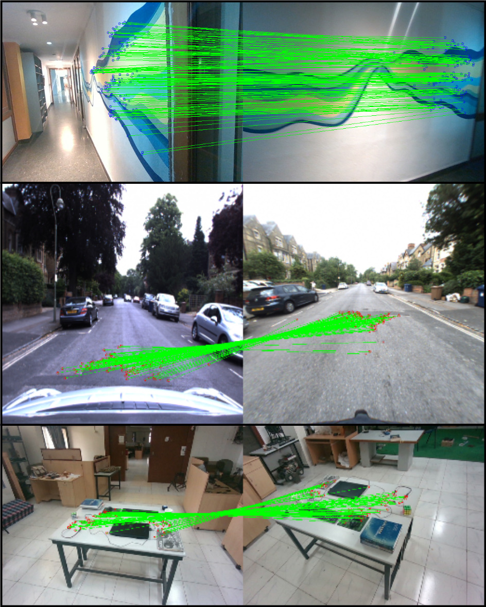
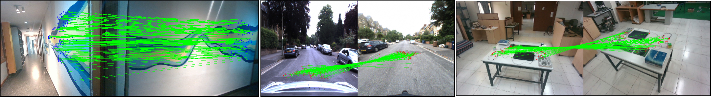
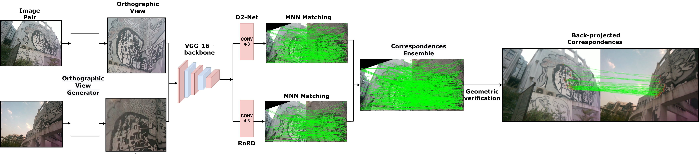
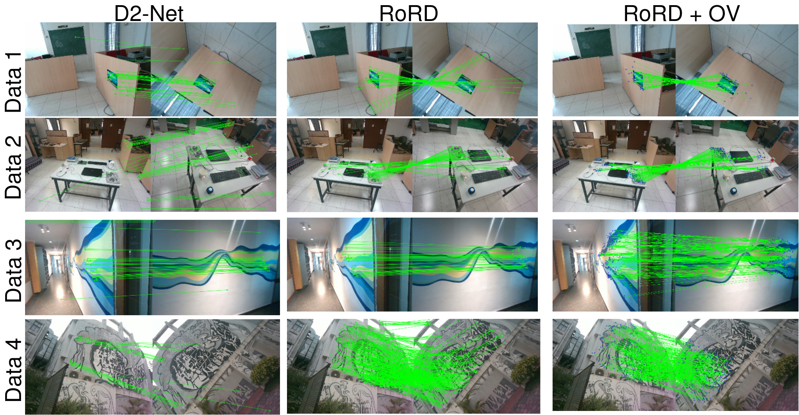

# RoRD: Rotation-Robust Descriptors and Orthographic Views for Local Feature Matching  
#### [Udit Singh Parihar](https://www.linkedin.com/in/udit-singh-parihar-0bab24b7/)\*1, [Aniket Gujarathi](https://www.linkedin.com/in/aniket-gujarathi/?originalSubdomain=in)\*1, [Kinal Mehta](https://kinalmehta.github.io/)\*1, [Satyajit Tourani](https://scholar.google.com/citations?user=943lKscAAAAJ&hl=en)\*1, [Sourav Garg](https://www.linkedin.com/in/gargsourav/)2, [Michael Milford](https://www.linkedin.com/in/michaeljmilford/)2 and [K. Madhava Krishna](https://robotics.iiit.ac.in/)1  

\* Denotes Equal Contribution  
1 Robotics Research Center, IIIT Hyderabad.  
2 QUT Centre for Robotics, Queensland University of Technology (QUT), Australia. 

> #### [Paper](https://arxiv.org/abs/2103.08573) | [Code](https://github.com/UditSinghParihar/RoRD)  
> Accepted to [IROS 2021](https://www.iros2021.org/)  

<!--  -->
<!--  -->

<!-- 

 -->
  

**Local feature matches using RoRD**. Our method RoRD finds precise local feature correspondences under extreme viewpoint (180 degrees) changes for both indoor and outdoor sequences.  

<iframe width="560" height="315" src="https://www.youtube.com/embed/4n6_6TMnlOc" frameborder="0" allow="accelerometer; autoplay; clipboard-write; encrypted-media; gyroscope; picture-in-picture" allowfullscreen></iframe>

## Abstract   
We present a novel framework that combines learning of invariant descriptors through data augmentation and orthographic viewpoint projection. We propose *rotation-robust* local descriptors, learnt through training data augmentation based on rotation homographies, and a *correspondence ensemble* technique that combines vanilla feature correspondences with those obtained through rotation-robust features. Using a range of benchmark datasets as well as contributing a new bespoke dataset for this research domain, we evaluate the effectiveness of the proposed approach on key tasks including pose estimation and visual place recognition.  

<!--  -->

 **RoRD pipeline**. Our approach takes a pair of perspective view images with significant viewpoint as input to the Orthographic View Generator, which aligns the camera to the plane-surface-normal to generate the top views. These top views are then passed to an ensemble of *Vanilla D2-Net* and *RoRD* techniques (ours). This approach creates precise feature correspondences that are robust to variations in viewpoints.

## Dataset  
The DiverseView dataset consists of 4 scenes of indoor and outdoor locations, with images captured at high viewpoint changes and camera rotations (up to 180 degrees). For the data collection, we have used the Intel RealSense D455 camera with RGB, Depth, and IMU sensors.  

The three sequences of this dataset are as follows: 
1. *Sequence 1* consists of 1138 images of an office-desk scene captured by moving around it in a semi-circular path, thus exhibiting extreme rotation variations.   
2. Sequence 2 consists of 2534 images obtained from a 360 degrees traversal about a table-top.   
3. *Sequence 3* consists of 1519 images facing a wall with high viewpoint changes but limited camera rotations.   
4. *Sequence 4* consists of 3931 images captured around a building with graffiti-art with varied camera viewpoints and rotations in low-lighting dusk conditions.  

## Results  

 

**Qualitative results from the DiverseView dataset**. Each row corresponds to a different sequence from the dataset. *RoRD* leverages its learnt *rotation-robust features* to obtain precise feature correspondences, outperforming D2-net. Incorporating orthographic views with RoRD, *(RoRD + OV)* further improves performance, and outperforms both D2-Net and RoRD for all the four sequences.  

---

| **Model**         | **Standard**              | **Rotated**               | **Average**               |
| ----------------- | ------------------------- | ------------------------- | ------------------------- |
| SIFT              | 0.52/0.54/0.54            | <u><b>0.51/0.51/0.52</b></u>            | <u>0.52/0.53/0.53</u>     |
| SuperPoint        | 0.69/0.71/0.73            | 0.21/0.22/0.22            | 0.45/0.46/0.48            |
| D2-Net            | **0.73/0.81/0.84**        | 0.17/0.20/0.22            | 0.45/0.50/0.53            |
| (Ours) RoRD       | 0.68/0.75/0.78            | <u>0.46/0.57/0.62</u>     | **0.57/0.66/0.70**        |
| (Ours) RoRD Comb. | <u>0.71/0.78/0.81</u>     | 0.44/0.54/0.59            | **0.57/0.66/0.70**        |
| (Ours) RoRD + CE  | <u><b>0.79/0.84/0.86</b></u> | **0.48/0.59/0.64**     | <u><b>0.64/0.72/0.75</b></u> | 

**Quantitative results for MMA on the HPatches dataset using pixel thresholds 6/8/10**. We highlight First, Second and Third best MMA values. We also provide averages over the results obtained by the Standard and Rotated HPatches dataset. Our Ensemble method ,RoRD + CE, outperforms all other methods with RoRD and SIFT being the second and the third best performer for the averaged HPatches datasets, respectively. However on the Rotated HPatches SIFT is able to outperforms other methods, with RORD Ensemble being the close second.
